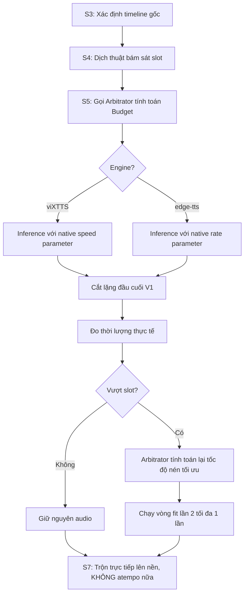

# Phản biện & Phân tích chuỗi xử lý GIỌNG — FlowApp (Gemini Agent)

Tài liệu này ghi lại kết quả phản biện, phát hiện bổ sung và đề xuất thiết kế kiến trúc từ Gemini Agent cho tài liệu [AUDIT_GIONG.md](file:///F:/MyProject/vietsubvideo/AUDIT_GIONG.md). Mọi phân tích dưới đây đều dựa trên việc đối chiếu trực tiếp với mã nguồn tại commit `0c43a2e`.

---

## 1. Phản biện 12 kết luận trong AUDIT_GIONG.md (Mục 4)

Qua việc kiểm tra chi tiết từng file mã nguồn, chúng tôi **XÁC NHẬN (CONFIRMED)** toàn bộ 12 kết luận trong tài liệu audit của Claude là chính xác về mặt kỹ thuật. Tuy nhiên, chúng tôi xin làm rõ và bổ sung một số chi tiết sâu hơn dưới góc độ dòng chảy dữ liệu:

### 1.1. MAX_SPEEDUP bị tiêu 2 lần độc lập (Kết luận 1)
*   **Xác nhận:** Hoàn toàn chính xác. Trong [s5_tts.py:123-126](file:///F:/MyProject/vietsubvideo/core/stages/s5_tts.py#L123-L126), hệ thống tính toán rate mới cho edge-tts bằng cách ép nhanh tối đa lên đến `_FIT_RATE_MAX` (50% tương đương 1.5x) dựa trên `config.MAX_SPEEDUP`. Sau đó, trong [s7_mix.py:70-76](file:///F:/MyProject/vietsubvideo/core/stages/s7_mix.py#L70-L76), ffmpeg `atempo` tiếp tục được áp dụng với hệ số lên đến `config.MAX_SPEEDUP`. Tổng tốc độ thực tế có thể lên tới $1.5 \times \text{MAX\_SPEEDUP}$ (ví dụ: $1.5 \times 2.0 = 3.0\text{x}$).
*   **Bổ sung về công thức tính rate thiếu số hạng chéo:**
    Công thức trong code hiện tại:
    `total = base + min(allow, math.ceil((dur / slot - 1) * 100))`
    Nếu câu gốc đã có `base` rate (do prosody hoặc emotion) là $B\%$, tức tốc độ phát là $1 + B/100$. Thời lượng raw tương ứng là $D$. Để khớp vào slot $S$, tốc độ tổng mong muốn là $S_{target} = \frac{D_{orig}}{S} = \frac{D \cdot (1 + B/100)}{S}$.
    Tỉ lệ phần trăm rate tổng tương ứng phải là:
    $$Rate_{target} = (S_{target} - 1) \cdot 100 = \left(\frac{D}{S} - 1\right) \cdot 100 + \frac{D}{S} \cdot B$$
    Trong khi công thức của code chỉ là:
    $$Rate_{actual} = B + \left(\frac{D}{S} - 1\right) \cdot 100$$
    Sai số thiếu chính là số hạng chéo: $\left(\frac{D}{S} - 1\right) \cdot B$. Do $\frac{D}{S} > 1$ và $B > 0$, phần rate tính toán bị thiếu hụt làm âm thanh tạo ra ở S5 luôn dài hơn slot thực tế, gián tiếp ép S7 phải kích hoạt `atempo` lần 2.

### 1.2. Độ dài dịch chỉ ràng buộc bằng lời nhắc (Kết luận 2)
*   **Xác nhận:** Chính xác. Không có cơ chế đếm âm tiết hay CPS (Characters Per Second) để lọc hoặc dịch lại. Trong [s4_translate.py:251-277](file:///F:/MyProject/vietsubvideo/core/stages/s4_translate.py#L251-L277), vòng `review_pass` chỉ kiểm tra tính nhất quán và nhãn voice, hoàn toàn bỏ qua việc giới hạn độ dài câu sửa đổi.
*   **Bổ sung:** Nhiệt độ (`temperature`) của Gemini khi gọi structured output trong [core/llm.py:91](file:///F:/MyProject/vietsubvideo/core/llm.py#L91) bị hardcode cứng ở mức `0.7`. Điều này làm tăng tính sáng tạo nhưng giảm kiểm soát độ dài câu dịch ngắn gọn.

### 1.3. S5 và S7 đo bằng 2 thước khác nhau (Kết luận 3)
*   **Xác nhận:** Chính xác. S5 đo bằng `ffprobe` trực tiếp trên tệp `.mp3` thô chứa khoảng lặng (silence pad) ở hai đầu (khoảng 0.3s - 0.9s). S7 nạp audio thông qua `_load_voice` và tiến hành cắt lặng bằng `_trim_silence` trước khi tính thời lượng. Mâu thuẫn này dẫn đến việc S5 báo "tràn thoại giả" và cố ép tăng tốc độ đọc, trong khi thực tế âm thanh đã cắt lặng của S7 vừa vặn với slot.

### 1.4. Tràn sau atempo không bị cắt (Kết luận 4)
*   **Xác nhận:** Chính xác. Trong [s7_mix.py:87-88](file:///F:/MyProject/vietsubvideo/core/stages/s7_mix.py#L87-L88), nếu giọng lồng tiếng vẫn dài hơn slot sau khi đã đạt trần `MAX_SPEEDUP`, hệ thống vẫn đè mảng numpy lên đến `start + len(voice)`, đè hẳn sang timeline của câu tiếp theo. Đồng thời, cửa sổ ducking nhạc nền của S6 chỉ dựa trên `seg["end"]` ban đầu của câu, khiến phần thoại tràn đè lên nhạc nền chưa được hạ âm lượng ở mode `flat/0`.

### 1.5. viXTTS không có kiểm soát thời lượng và lỗi fallback (Kết luận 5)
*   **Xác nhận:** Chính xác. Nhánh `_tts_vixtts` trong [s5_tts.py:227-234](file:///F:/MyProject/vietsubvideo/core/stages/s5_tts.py#L227-L234) không hề gọi hàm `_fit_slot` để kiểm soát độ dài. Khi xảy ra lỗi GPU/model, hệ thống fallback sang edge-tts nhưng lại ghi tệp `.sig` dưới dạng `"edge:..."` trong khi chữ ký mong muốn (`_voice_sig`) của viXTTS là `"vix:def:..."` hoặc `"vix:ref:..."`. Do đó, ở lần chạy tiếp theo, stage TTS sẽ luôn chạy lại câu này bằng viXTTS thay vì tận dụng cache.

### 1.6. Các kết luận khác (Kết luận 6 - 12)
*   **Mục 6 (Lệch ngân sách S4 & S5):** Chính xác. S4 tính `max_s` từ `end - start`, còn S5/S7 tính `slot` từ `next_start - start`.
*   **Mục 8 (vocals.wav nhiễm nhạc):** Xác nhận điểm cực kỳ nghiêm trọng: `s5_tts` (TTS) chạy trước `s6_bgm` (tách nhạc nền demucs), do đó file `vocals.wav` hoàn toàn **không tồn tại** khi `prosody.measure` chạy ở S5. Hệ thống luôn phải đo trên `audio_16k.wav` hoặc `audio_full.wav` vốn chứa toàn bộ nhạc nền, làm sai lệch kết quả đo pitch/volume.

---

## 2. Phát hiện BỎ SÓT trong chuỗi giọng (s3→s8)

Ngoài các lỗi được chỉ ra trong audit của Claude, chúng tôi phát hiện thêm các điểm bất ổn kiến trúc sau:

### 2.1. API Nghe thử (`/api/tts-preview`) không nhận diện Job Context
Trong [webui/server.py:1450-1545](file:///F:/MyProject/vietsubvideo/webui/server.py#L1450-L1545), endpoint `/api/tts-preview` không hề nhận tham số `job_id` từ frontend. Điều này dẫn đến:
1.  **Bỏ qua cấu hình override của job:** Nó luôn sử dụng cấu hình global (`config.TTS_ENGINE`, `config.TTS_SINGLE_VOICE`) để xử lý. Nếu người dùng chỉnh tùy chọn riêng cho job (ví dụ: chuyển từ edge sang viXTTS), nút nghe thử 🔊 vẫn phát giọng edge-tts.
2.  **Mất casting nhân vật:** Nếu segment được cast giọng đặc trưng (`voice_ref`) qua bảng casting series (`core/series.py`), API nghe thử không hề biết trừ khi frontend gửi kèm `voice_ref` trong body.
3.  **Lỗi logic engine viXTTS:** Nếu `config.TTS_ENGINE == "vixtts"` nhưng segment không có `voice_ref` (đọc bằng giọng nam/nữ mặc định), logic nghe thử lại tự động rơi xuống nhánh `edge-tts` (dòng 1515) thay vì gọi `vixtts.synth`. Người dùng bấm nghe thử nghe thấy giọng robot edge-tts nhưng khi render thật lại là giọng viXTTS.

### 2.2. vocals.wav bị xoá sạch sau khi Demucs chạy
Trong [core/separate.py:44-48](file:///F:/MyProject/vietsubvideo/core/separate.py#L44-L48), demucs tách ra 2 tệp `no_vocals.wav` và `vocals.wav`. Tuy nhiên, hàm `no_vocals` chỉ di chuyển tệp `no_vocals.wav` ra thư mục job và gọi `shutil.rmtree(outroot)` để giải phóng đĩa cứng. Hành động này **xóa bỏ hoàn toàn** tệp `vocals.wav` (vocal sạch tiếng Trung).
Do đó, ngay cả khi chúng ta thay đổi thứ tự chạy stage (đưa Demucs lên trước TTS), S5 vẫn không thể tìm thấy `vocals.wav` vì nó đã bị xóa sạch ở bước tách!

### 2.3. Demucs CPU Fallback làm treo Job trên máy không có GPU
Khi cấu hình `KEEP_BGM=1` nhưng máy người dùng không có GPU hoặc driver CUDA bị lỗi, `demucs` sẽ tự động fallback chạy trên CPU. Đối với video dài hơn 10 phút, việc tách vocal trên CPU có thể mất từ 1 đến vài tiếng. Pipeline không hề có timeout hay cảnh báo cho trường hợp này, khiến tiến trình trông như bị treo vĩnh viễn.

### 2.4. Phân rã phụ đề (`SUB_SPLIT`) gây đứt đoạn câu
Hàm `_split_text` trong [core/stages/s8_render.py:48-77](file:///F:/MyProject/vietsubvideo/core/stages/s8_render.py#L48-L77) chia văn bản tiếng Việt dựa trên độ dài của các câu phụ đề gốc. Tuy nhiên, cấu trúc ngữ pháp và độ dài từ vựng của tiếng Việt khác hoàn toàn tiếng Trung/Anh. Việc chia cắt máy móc này đôi khi bổ đôi các cụm từ cố định hoặc tên riêng (ví dụ: "Đường Tam" bị tách thành "Đường" ở dòng sub trước và "Tam" ở dòng sub sau) gây khó chịu cho người xem dù giọng đọc vẫn liền mạch.

### 2.5. Preview nghe thử không được Master Volume chuẩn hóa
Âm thanh trả về từ `/api/tts-preview` không đi qua bước chuẩn hóa âm lượng (`loudnorm -14 LUFS`) như khi render thật. Người dùng điều chỉnh âm lượng trong editor dựa trên preview nghe thử sẽ thấy âm thanh video render ra lúc quá to, lúc quá nhỏ.

---

## 3. Đánh giá đề xuất V1 – V13 và Đề xuất tối ưu

| Đề xuất | Đánh giá tính khả thi & Rủi ro | Ưu tiên | Gợi ý cải tiến từ Gemini |
| :--- | :--- | :--- | :--- |
| **V1 (Trim câm sớm)** | **Rất cao.** Không có rủi ro kỹ thuật. Giúp thống nhất thước đo thời lượng giữa S5 và S7. | **P0 (Cao nhất)** | Cần viết một module utility dùng chung cho cả S5 và S7 để đảm bảo tính nhất quán của thuật toán cắt lặng. |
| **V2 (XTTS speed & loop fit)** | **Cao.** Coqui XTTS hỗ trợ tham số `speed` (tác động trực tiếp vào quá trình inference qua `length_scale`), chất lượng tự nhiên hơn nhiều so với atempo. | **P0** | Tránh synth lại quá 2 lần để bảo vệ hiệu năng GPU. Tính toán speed target chính xác ngay từ đầu. |
| **V3 (Consolidate speed)** | **Rất cao.** Loại bỏ chồng nhân tốc độ giữa S5 và S7. Tốc độ nén chỉ được quyết định một lần. | **P0** | Xem thiết kế kiến trúc Trọng tài ở Mục 4. |
| **V4 (Cắt/fade 100ms)** | **Trung bình.** Có thể làm mất từ cuối của câu nếu bị cắt gắt. | **P1** | Ưu tiên fade out mềm (audio fade) trong 100ms cuối của slot để tránh tiếng "bụp" do cắt đột ngột. |
| **V5 (S4 dùng slot thực tế)** | **Cao.** Claude/Gemini dịch dựa trên slot thực của video gốc giúp hạn chế dịch quá dài ngay từ đầu. | **P1** | Đưa thông số `max_s` tính theo công thức `next_start - start - 0.2s` (chừa 0.2s thở). |
| **V6 (Dịch lại khi vượt CPS)** | **Trung bình.** Rủi ro tăng chi phí API và làm chậm thời gian dịch. | **P2** | Chỉ kích hoạt dịch lại tối đa 1 lần nếu câu vượt quá 4.5 âm tiết/giây-slot. |
| **V7 (Review pass chặt chẽ)** | **Cao.** Không tốn thêm chi phí. | **P1** | Thêm điều kiện cứng vào Prompt của review pass để bắt buộc giữ độ dài ngắn hơn bản gốc. |
| **V8 (Target duration = miệng)** | **Cao.** Giúp giọng đọc tự nhiên, kết thúc đúng lúc nhân vật dừng nói thay vì lê thê hết slot. | **P1** | Rất cần thiết cho các phim có nhịp thoại chậm. |
| **V9 (Kéo chậm thoại ngắn)** | **Trung bình.** Kéo chậm giọng (pitch giữ nguyên) dễ gây tiếng "rè" hoặc ngọng nếu kéo quá 0.9x. | **P2** | Giới hạn hệ số kéo chậm tối thiểu là `0.92`. |
| **V10 (segtools gộp câu 1 từ)** | **Rất cao.** Né lỗi viXTTS không thể đọc tự nhiên các câu chỉ có 1-2 từ (thường bị ngân dài vô nghĩa). | **P1** | Tự động gộp câu < 3 từ vào câu lân cận nếu khoảng cách < 0.8s. |
| **V11 (Sửa API nghe thử)** | **Rất cao.** Sửa triệt để lỗi "nói dối" cấu hình giữa preview và render. | **P0** | **Bắt buộc truyền `job_id`** lên API nghe thử để tải đúng config override của job. |
| **V12 (UI đơn giản hóa)** | **Rất cao.** Tăng trải nghiệm người dùng. | **P2** | Nhóm các núm chỉnh chi tiết vào tab "Nâng cao", chỉ hiện Preset ở màn hình chính. |
| **V13 (Mix report chi tiết)** | **Rất cao.** Dễ debug và cải thiện chất lượng dịch/thu âm thủ công. | **P1** | Hiển thị cảnh báo đỏ trực tiếp lên Timeline của Editor đối với các câu bị nén > 1.3x. |

---

## 4. Thiết kế kiến trúc "Trọng tài thời lượng duy nhất" (Single Duration Arbitrator)

Để giải quyết triệt để vấn đề lệch pha thời lượng, chồng chéo config tốc độ, và đảm bảo chất lượng âm thanh tự nhiên nhất, chúng tôi đề xuất xây dựng một module trung tâm mang tên `core/arbitrator.py`. 

### 4.1. Sơ đồ luồng xử lý mới (Pipeline Flow)



### 4.2. Thiết kế chi tiết lớp `Arbitrator` (`core/arbitrator.py`)

```python
# [NEW] core/arbitrator.py
from __future__ import annotations
import math
import config

class DurationArbitrator:
    def __init__(self, start: float, end: float, next_start: float | None):
        self.start = start
        self.end = end
        
        # Ngân sách thời gian tối đa để không đè câu sau (sàn 0.3s)
        if next_start is not None:
            self.max_duration = max(0.3, next_start - start)
        else:
            self.max_duration = max(0.3, end - start + 2.0) # câu cuối cho phép dư dả
            
        # Thời lượng lý tưởng khớp với miệng nhân vật (sàn 0.4s)
        self.target_duration = max(0.4, end - start)
        
    def calculate_speed_factor(self, raw_duration: float) -> float:
        """
        Tính toán hệ số tốc độ (speed_factor) tối ưu:
        - 1.0: Tốc độ bình thường
        - > 1.0: Đọc nhanh hơn (co lại)
        - < 1.0: Đọc chậm hơn (giãn ra)
        """
        if raw_duration <= 0:
            return 1.0
            
        # 1. Mục tiêu hàng đầu: khớp với miệng nhân vật (target_duration)
        speed = raw_duration / self.target_duration
        
        # 2. Ràng buộc: Không được vượt quá max_duration (slot cản câu sau)
        min_speed_to_fit = raw_duration / self.max_duration
        if speed < min_speed_to_fit:
            speed = min_speed_to_fit
            
        # 3. Kẹp trong giới hạn tự nhiên của giọng nói con người
        # Tối đa theo núm xoay của user (ví dụ 1.4x), tối thiểu 0.9x để tránh bị méo giọng
        max_limit = getattr(config, "MAX_SPEEDUP", 1.4)
        speed = max(0.90, min(max_limit, speed))
        
        return round(speed, 3)

    def calculate_edge_rate(self, base_rate_pct: int, raw_duration: float) -> int:
        """
        Tính toán rate (%) cho edge-tts bao gồm cả số hạng chéo (cross term).
        """
        speed = self.calculate_speed_factor(raw_duration)
        # edge-tts rate = (speed - 1) * 100
        # Nếu đã có base_rate (prosody/emotion) thì tích hợp chéo:
        total_rate = round((speed * (100 + base_rate_pct)) - 100)
        # Giới hạn an toàn của edge-tts (+50% đến -25%)
        return max(-25, min(50, total_rate))
```

### 4.3. Hướng triển khai thay thế trong các Stage

1.  **Trong `s5_tts.py`:**
    *   Sau khi chạy synth (dù là viXTTS hay edge-tts) lần đầu ở tốc độ mặc định, gọi hàm cắt im lặng đầu cuối ngay lập tức.
    *   Đo thời lượng thực tế của audio sạch.
    *   Truyền thời lượng sạch vào `DurationArbitrator`. Nếu hệ số tốc độ tính ra lệch quá 5% so với hiện tại, tiến hành synth lại lần 2 (áp dụng tham số `speed` cho viXTTS hoặc `rate` cho edge-tts).
    *   Lưu tệp âm thanh hoàn chỉnh. Bước này đảm bảo âm thanh đã vừa khít slot trước khi sang S7.
2.  **Trong `s7_mix.py`:**
    *   Nạp tệp âm thanh (đã được tối ưu hóa tốc độ ở S5).
    *   Loại bỏ hoàn toàn logic `ffmpeg atempo` tự động tăng tốc lần 2. S7 chỉ làm nhiệm vụ duy nhất: đặt mảng numpy lên đúng vị trí `start` của timeline.
    *   Nếu tệp âm thanh vẫn bị tràn (do giới hạn trần `MAX_SPEEDUP`), áp dụng fade-out trong 100ms cuối của slot để tránh chèn đè đột ngột lên segment sau.

---
*Tài liệu phân tích kết thúc. Vui lòng phản hồi ý kiến hoặc xác nhận triển khai để chúng tôi thực hiện các thay đổi mã nguồn tương ứng.*
